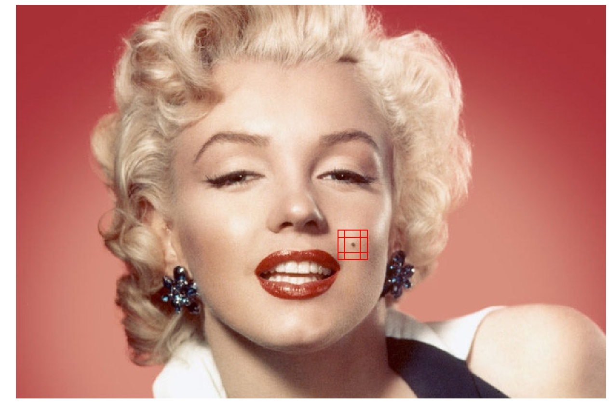

    

<h1 align="center">Deep learning a gyakorlatban Python és LUA alapon | VITMAV45</h1>
<h2 align="center">Nagy házi feladat</h2>

<b>Team:</b> Molehub

<b>Team members:</b>
* Küttel Dániel (QPPXW1) email: kutteljr@gmail.com
* Siket Máté (N1C4Z9) email: siket.mate@gmail.com

<b>Topic:</b> Mole detection with deep learning

## Table of Contents
* [I. Motivation](#i-motivation)
* [II. Installation](#ii-installation)
* [III. Notebooks](#iii-notebooks)
    + [3.1 Creating database](#31-creating-database)
    + [3.2 MoleDetector with MLP](#32-moledetector-with-mlp)
    + [3.3 MoleDetector with CNN](#33-moledetector-with-cnn)
    + [3.4 MoleDetector with CNN+MLP](#34-moledetector-with-cnnmlp)

## I. Motivation
The current neural networks are developed to diagnose melanoma based on dermatoscopic images. On the other hand, during consultations we determined a different kind of approach. Our goal is to mark the moles on pictures which are taken from different distances at different angles, resolutions and lighting conditions. The "cutouts" could be later used for detailed investigation or mole appareance follow-up.

## II. Installation
    git clone https://github.com/simate6/MoleDetector.git
    pip install -r requirements.txt

## III. Notebooks
### 3.1 Creating database
[DataBase1](DataBase1), [DataBase2](DataBase2) & [DataBaseBCKG](DataBaseBCKG) are containing the images that we're using for cropping ROIs.
The [create_dataset.ipynb](create_dataset.ipynb) notebook will do the work and [Cropped](Cropped) & [CroppedBCKG](CroppedBCKG) are the folders with the resulted images.

### 3.2 MoleDetector with MLP
Implementation of _Multilayer perceptron_ with gray scale images:

* Notebook for training: [MoleDetector_MLP_Training.ipynb](MoleDetector_MLP_Training.ipynb)
* Notebook for testing: [MoleDetector_MLP_Detection.ipynb](MoleDetector_MLP_Detection.ipynb)

### 3.3 MoleDetector with CNN
Implementation of _Convolutional Neural Network_ with RGB images:

* Notebook for training: [MoleDetector_CNN_Training.ipynb](MoleDetector_CNN_Training.ipynb)
* Notebook for testing: [MoleDetector_CNN_Detection.ipynb](MoleDetector_CNN_Detection.ipynb)

Implementation of _Convolutional Neural Network_ with normalised RGB images:

* Notebook for training: [MoleDetector_CNNnormalised_Training.ipynb](MoleDetector_CNNnormalised_Training.ipynb)
* Notebook for testing: [MoleDetector_CNNnormalised_Detection.ipynb](MoleDetector_CNNnormalised_Detection.ipynb)

### 3.4 MoleDetector with CNN+MLP

Here we're using a mixed model with the aim of getting better results:

* Notebook: [MoleDetector_CNN+MLP_Detection.ipynb](MoleDetector_CNN+MLP_Detection.ipynb)
